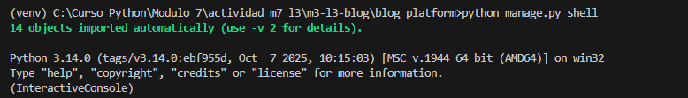
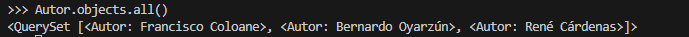
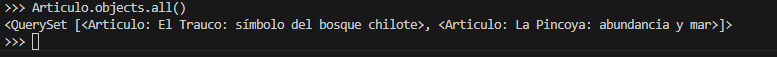
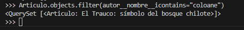
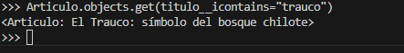
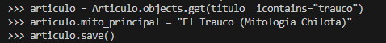
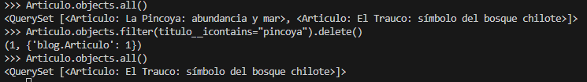

# Blog de Mitología Chilota

**Módulo:** Acceso a datos en Aplicaciones Python-Django  
**Actividad:** Experiencia de Aprendizaje N°3 – Módulo 7  
**Autor:** Ximena Garrido  

---

## 📖 Descripción del Proyecto

Este proyecto corresponde al desarrollo de una aplicación web backend utilizando
el framework **Django** y una base de datos **PostgreSQL**, cuyo objetivo principal
es modelar y gestionar información mediante el **ORM de Django**.

La aplicación implementa un **blog cultural** enfocado en la **mitología chilota**,
permitiendo la gestión de **autores** y **artículos**, así como la ejecución de
consultas ORM para operaciones CRUD directamente desde la terminal.

---

## 🛠 Tecnologías Utilizadas

- Python 3  
- Django  
- PostgreSQL  
- Django ORM  
- Git y GitHub  

---

## 🚀 Pasos Seguidos para el Desarrollo

A continuación se describen los pasos técnicos realizados para el desarrollo
del proyecto, desde la configuración inicial hasta la interacción con la base
de datos mediante el ORM.

### 1. Creación del Proyecto y Entorno

- Se creó un repositorio Git y se clonó en el entorno local.
- Se creó y activó un entorno virtual para aislar dependencias.
- Se instaló Django y el driver de PostgreSQL.
- Se creó el proyecto Django mediante:

```bash
django-admin startproject blog_platform
```

* Se creó la aplicación principal del proyecto:

```bash
python manage.py startapp blog
```

---

### 2. Configuración de la Base de Datos PostgreSQL

* Se creó una base de datos local llamada `blog_chilote` en PostgreSQL.
* En el archivo `settings.py` se configuró la conexión a PostgreSQL,
  reemplazando SQLite por defecto, indicando motor, nombre de la base de datos,
  usuario, contraseña, host y puerto.

---

### 3. Definición del Modelo de Datos

* En el archivo `models.py` de la aplicación `blog` se definieron los modelos:

  * **Autor**, con campos para nombre, biografía y región.
  * **Articulo**, con campos para título, contenido, mito principal, fecha de
    creación y una relación `ForeignKey` hacia Autor.
* Se implementó el método `__str__` para mejorar la visualización de los registros
  en el panel de administración.

---

### 4. Migraciones

* Se generaron los archivos de migración con:

```bash
python manage.py makemigrations
```

* Se aplicaron las migraciones a la base de datos PostgreSQL con:

```bash
python manage.py migrate
```

---

### 5. Consultas ORM desde Django Shell

* Se accedió a la consola interactiva de Django mediante:

```bash
python manage.py shell
```

* Desde la terminal se realizaron consultas ORM para:

  * Listar registros (READ)
  * Filtrar datos
  * Obtener registros específicos
  * Actualizar registros (UPDATE)
  * Eliminar registros (DELETE)

Estas operaciones demuestran el uso correcto del ORM de Django para interactuar
con la base de datos sin utilizar SQL directo.

---

## 📂 Estructura del Proyecto

```text
m3-l3-blog/
│
├── blog_platform/
│   ├── blog_platform/
│   │   ├── settings.py
│   │   ├── urls.py
│   │   └── ...
│   │
│   ├── blog/
│   │   ├── migrations/
│   │   ├── models.py
│   │   ├── views.py
│   │   ├── urls.py
│   │   ├── admin.py
│   │   ├── templates/
│   │   └── static/
│   │
│   └── manage.py
│
├── evidencias/
│   ├── orm_shell_inicio.png
│   ├── orm_autores_all.png
│   ├── orm_articulos_all.png
│   ├── orm_filtro_autor.png
│   ├── orm_get_articulo.png
│   ├── orm_update_articulo.png
│   └── orm_delete_articulo.png
│
└── README.md
```

---

## 📸 Evidencias – Consultas ORM en la Terminal

A continuación se presentan capturas de pantalla de la terminal que muestran
las consultas realizadas mediante el **ORM de Django** utilizando **Django Shell**.
Las evidencias corresponden a operaciones CRUD sobre los modelos definidos.

---

### 🔹 Acceso a Django Shell

**Consulta utilizada:**

```python
python manage.py shell
```

📷 **Evidencia:**


---

### 🔹 Consulta ORM – Listado de Autores (READ)

**Consulta utilizada:**

```python
Autor.objects.all()
```

📷 **Evidencia:**


---

### 🔹 Consulta ORM – Listado de Artículos (READ)

**Consulta utilizada:**

```python
Articulo.objects.all()
```

📷 **Evidencia:**


---

### 🔹 Consulta ORM – Filtro de Artículos por Autor

**Consulta utilizada:**

```python
Articulo.objects.filter(autor__nombre__icontains="coloane")
```

📷 **Evidencia:**


---

### 🔹 Consulta ORM – Obtención de un Artículo Específico

**Consulta utilizada:**

```python
Articulo.objects.get(titulo__icontains="trauco")
```

📷 **Evidencia:**


---

### 🔹 Consulta ORM – Actualización de un Artículo (UPDATE)

**Consulta utilizada:**

```python
articulo = Articulo.objects.get(titulo__icontains="trauco")
articulo.mito_principal = "El Trauco (Mitología Chilota)"
articulo.save()
```

📷 **Evidencia:**


---

### 🔹 Consulta ORM – Eliminación de un Artículo (DELETE)

**Consulta utilizada:**

```python
Articulo.objects.filter(titulo__icontains="pincoya").delete()
```

📷 **Evidencia:**


---
Proyecto académico desarrollado con fines educativos.

